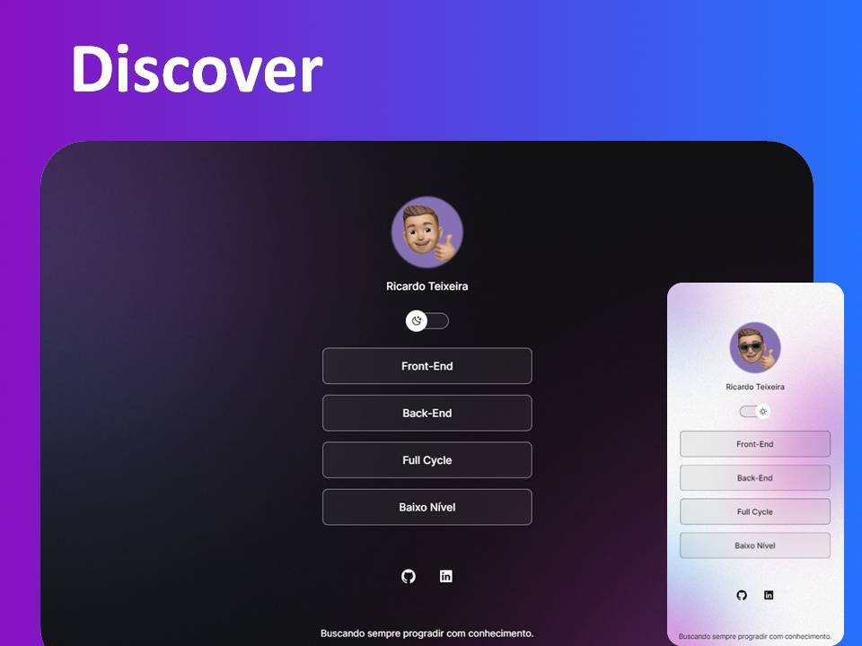

<h1 align="center"> Discover </h1>

Discover é um primeiro projeto que servirá de Portfólio para outros projetos que virão.  
<a href="https://www.rocketseat.com.br/discover">Aprenda programação clicando aqui.</a>

  <a href="#-tecnologias">Tecnologias</a>&nbsp;&nbsp;&nbsp;|&nbsp;&nbsp;&nbsp;
  <a href="#-projeto">Projeto</a>&nbsp;&nbsp;&nbsp;|&nbsp;&nbsp;&nbsp;
  <a href="#-layout">Layout</a>&nbsp;&nbsp;&nbsp;|&nbsp;&nbsp;&nbsp;
  <a href="#memo-licença">Licença</a>

  

 

  

## 🚀 Tecnologias

Esse projeto foi desenvolvido com as seguintes tecnologias:

- HTML e CSS
- JavaScript
- Git e Github
- Figma

## 💻 Projeto

O Discover é um agregador de links que serão usados como base de conhecimento, durante a montagem do portfolio de projetos. Conforme novos projetos forem sendo criados, o Discover será incrementado.

- [Acesse o projeto finalizado, online](https://github.com/Ricardo7484/discover.git)

- [É iniciante na programação](https://www.rocketseat.com.br/discover)

## 🔖 Layout

Você pode visualizar o layout do projeto através [DESSE LINK](https://www.figma.com/community/file/1187422022288947321). É necessário ter conta no [Figma](https://figma.com) para acessá-lo.

## :memo: Licença

Esse projeto está sob a licença MIT.

---

Buscando sempre progradir com conhecimento :wave: [🧑‍💻](https://www.linkedin.com/in/ricardo-silvateixeira/)